<p align="center">
  <a href="https://rennie.renthero.com">
    
  </a>
</p>

<h1 align="center">Rennie</h1>

<p align="center">
  <strong>AI-powered knowledge hub for Obsidian</strong><br>
  <sub>Chat with your AI teammate · Sync your vault · Stay in flow</sub>
</p>

<p align="center">
  <a href="https://rennie.renthero.com"></a>
  <a href="https://github.com/Rent-Hero-Organisation/obsidian-rennie/releases"></a>
</p>

---

## What is Rennie?

Rennie is an Obsidian plugin that connects your vault to your team's AI assistant. She lives in your sidebar, knows your codebase, and keeps everyone's notes in sync.

**💬 Chat** — Talk to your AI teammate without leaving Obsidian  
**🔄 Sync** — Notes, decisions, and research stay in sync across the team  
**🔑 Auth** — One-click GitHub login. No tokens, no URLs, no config  
**👥 Org-only** — Access restricted to your GitHub organization  

## Quick Start

```
1. Install Obsidian         → obsidian.md
2. Install BRAT plugin      → Add: Rent-Hero-Organisation/obsidian-rennie
3. Open settings → Login    → Done.
```

Or visit **[rennie.renthero.com](https://rennie.renthero.com)** for the interactive setup guide.

## Terminal Banner

```
  ██▀▀▄ █▀▀ █▄ █ █▄ █ ▀█▀ █▀▀
  █▀▀▄▀ █▀▀ █ ▀█ █ ▀█  █  █▀▀
  ▀  ▀▀ ▀▀▀ ▀  ▀ ▀  ▀ ▀▀▀ ▀▀▀  🏠
```

Coloured version: `node assets/banner.js`

## Development

```bash
git clone https://github.com/Rent-Hero-Organisation/obsidian-rennie.git
cd obsidian-rennie && npm install
npm run dev    # watch
npm run build  # production
```

## Infrastructure

See [`infra/INFRASTRUCTURE.md`](infra/INFRASTRUCTURE.md) for deployment, migration, and architecture docs.

---

<p align="center">
  <sub>Built by <a href="https://renthero.com">RentHero</a> · Powered by <a href="https://openclaw.ai">OpenClaw</a></sub>
</p>
