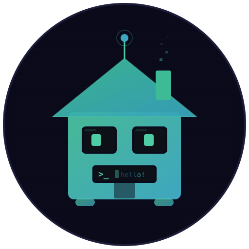
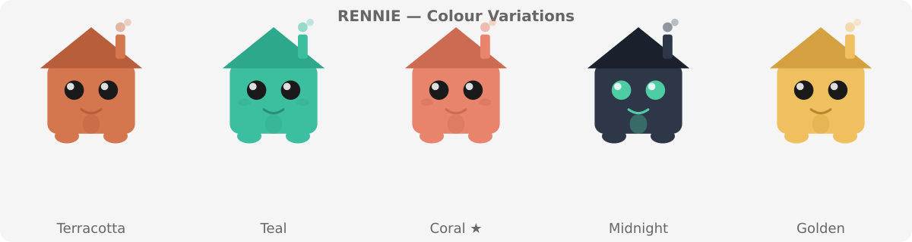

<p align="center">
  <a href="https://rennie.renthero.com">
    
  </a>
</p>

<h1 align="center">Rennie</h1>

<p align="center">
  <strong>Your AI-powered knowledge hub for Obsidian</strong><br>
  Chat with your AI teammate. Sync your vault. Stay in flow.
</p>

<p align="center">
  <a href="https://rennie.renthero.com">Setup Guide</a> ·
  <a href="https://github.com/Rent-Hero-Organisation/obsidian-rennie/releases">Releases</a> ·
  <a href="https://renthero.com">RentHero</a>
</p>

---

## What is Rennie?

Rennie is an Obsidian plugin that connects your vault to your team's AI assistant. Chat in the sidebar, sync files automatically, and authenticate with one click via GitHub.

- 🏠 **Chat sidebar** — Talk to your AI teammate without leaving Obsidian
- 🔄 **Bidirectional sync** — Vault files stay in sync across the team
- 🔑 **GitHub OAuth** — One-click login, no tokens to copy
- 👥 **Org-only access** — Restricted to your GitHub organization

## Quick Start

1. Install [Obsidian](https://obsidian.md/download)
2. Install [BRAT](https://github.com/TfTHacker/obsidian42-brat) → add `Rent-Hero-Organisation/obsidian-rennie`
3. Open plugin settings → **Login with GitHub**
4. Done — chat and sync just work

Or visit **[rennie.renthero.com](https://rennie.renthero.com)** for the full setup guide.

## Features

### Chat
Talk to your AI assistant in the Obsidian sidebar. It has context about your vault, your codebase, and your team's decisions.

### Sync
Files sync bidirectionally every 15 minutes (configurable). Conflict resolution built in — choose local, remote, or decide per-file.

### Auth
Authenticate via GitHub OAuth. Your org membership is verified automatically. Tokens are stored securely in your OS keychain.

## Animated Rennie

<p align="center">
  
</p>

## Colour Variants

<p align="center">
  
</p>

## Infrastructure

See [`infra/INFRASTRUCTURE.md`](infra/INFRASTRUCTURE.md) for deployment docs, migration checklist, and architecture diagrams.

## Development

```bash
git clone https://github.com/Rent-Hero-Organisation/obsidian-rennie.git
cd obsidian-rennie
npm install
npm run dev    # Watch mode
npm run build  # Production build
```

## Terminal Banner

```
  ██▀▀▄ █▀▀ █▄ █ █▄ █ ▀█▀ █▀▀
  █▀▀▄▀ █▀▀ █ ▀█ █ ▀█  █  █▀▀
  ▀  ▀▀ ▀▀▀ ▀  ▀ ▀  ▀ ▀▀▀ ▀▀▀  🏠
```

Coloured version: `node assets/banner.js`

## License

MIT — forked from [AndyBold/obsidian-openclaw](https://github.com/AndyBold/obsidian-openclaw)

---

<p align="center">
  Built by <a href="https://renthero.com">RentHero</a> · Powered by <a href="https://openclaw.ai">OpenClaw</a>
</p>
